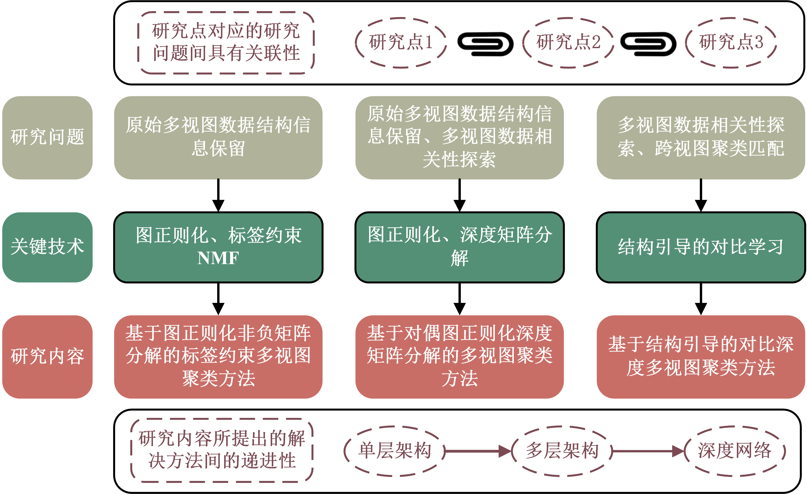

# 李彬大论文
基于矩阵分解合对比学习的多视图聚类方法研究
> **作者**
李彬

## 摘要
随着数据的获取途径和手段不断丰富，同一对象不同类型的数据可以轻易获得。提取自同一对象不同来源、角度或描述符的数据被视为多视图数据，其具有对象的不同特征、维度和结构描述，利用视图间的相关性和一致性进行聚类分析成为近年的研究热点。由于矩阵分解和对比学习在探索多视图数据相关性和一致性方面的优势，已被广泛应用于开发多视图聚类方法。虽然现有多视图聚类方法聚焦于多视图数据相关性和一致性开发，但仍然存在以下不足：（1）无法有效保留原始多视图数据包含的结构信息；（2）对多视图数据相关性的探索存在不足；（3）聚类过程以多视图融合的方式进行缺乏跨视图聚类匹配。因此，本文围绕上述存在于多视图聚类中的问题开展以下研究工作：  
（1）提出基于图正则化非负矩阵分解的标签约束多视图聚类。包含在原始多视图数据中的结构信息对多视图表征学习至关重要，然而现有非负矩阵分解多视图聚类未能在聚类过程中有效保留多视图结构信息的问题。因此，本文提出了一种引入有限的标记样本引导聚类过程的图正则化非负矩阵分解多视图聚类方法，旨在利用特征、数据和标签空间中的图正则化保留多视图数据的结构信息。该方法的核心在于引入有限的多视图标记样本对聚类过程施加硬约束，并利用自权重策略综合考虑不同视图结构信息的重要性和平衡特征、数据、标签空间中的图结构信息，最终的聚类划分则通过学习聚类分配矩阵实现。在四个基准数据集上的大量实验结果表明，所提出的方法相较于近年来先进基线方法的优越性。  
（2）提出基于对偶图正则化深度矩阵分解的多视图聚类。有效地探索多视图数据的相关性能够提升多视图聚类模型的性能。针对现有基于矩阵分解的多视图聚类方法仅执行单层表征来探索多视图数据的相关性且无法有效保留多视图数据结构信息的问题，本文提出一种对偶图正则化深度矩阵分解多视图聚类方法。该方法的核心是通过多层分解的方式充分探索隐藏在多视图数据中的有效信息，并在每一层中引入对偶图正则化来保留多视图数据在特征和数据空间中的结构信息，稀疏约束的引入也使得多视图共识表征具有鲁棒性。在四个多视图基准数据集上的大量实验结果表明，所提出的RDDMF方法能够有效探索多视图数据的相关性并保留结构信息。  
（3）提出基于结构引导的对比深度多视图聚类。如何在探索多视图数据相关性的同时实现视图间聚类一致性是多视图聚类目前面临的挑战。现有的深度多视图聚类从特征层面出发利用对比学习探索多视图数据的相关性，在聚类层面相关性和一致性探索方面则存在不足。因此，本文提出了一种基于结构引导的对比深度多视图聚类方法，旨在利用结构引导的对比学习实现多视图数据相关性探索和多视图聚类划分的一致性。该方法在自编码框架中引入多视图特征结构引导的对比学习实现多视图高层次特征的对齐，并利用多视图聚类结构引导的对比学习实现多视图聚类划分的匹配。在多视图基准数据集上的大量实验结果表明，提出的SGFCC方法能够有效探索多视图数据间的相关性并实现一致的多视图聚类划分。
> **关键词**
多视图聚类；图正则化；约束矩阵分解；深度矩阵分解；自编码器；对比学习  

## 小论文
### 1. Multi-view clustering via label-embedded regularized NMF with dual-graph constraints（第二章）  
引用：  
>  @article{li2023multi,  
>    title={Multi-view clustering via label-embedded regularized NMF with dual-graph constraints},  
>    author={Li, Bin and Shu, Zhenqiu and Liu, Yingbo and Mao, Cunli and Gao, Shengxiang and Yu, Zhengtao},  
>    journal={Neurocomputing},  
>    volume={551},  
>    pages={126521},  
>    year={2023},  
>    publisher={Elsevier}  
>  }

### 2. Robust Dual-Graph Regularized Deep Matrix Factorization for Multi-view Clustering（第三章）  
引用：  
>  @article{shu2023robust,  
>    title={Robust dual-graph regularized deep matrix factorization for multi-view clustering},  
>    author={Shu, Zhenqiu and Li, Bin and Hu, Cong and Yu, Zhengtao and Wu, Xiao-Jun},  
>    journal={Neural Processing Letters},  
>    volume={55},  
>    number={5},  
>    pages={6067--6087},  
>    year={2023},  
>    publisher={Springer}  
>  } 

### 3. Structure-guided feature and cluster contrastive learning for multi-view clustering（第四章）
引用：  
>  @article{shu2024structure,    
>    title={Structure-guided feature and cluster contrastive learning for multi-view clustering},    
>    author={Shu, Zhenqiu and Li, Bin and Mao, Cunli and Gao, Shengxiang and Yu, Zhengtao},     
>    journal={Neurocomputing},     
>    pages={127555},    
>    year={2024},    
>    publisher={Elsevier}    
> }  

If you have any problems, contact me via [libinishere@gmail.com]().
